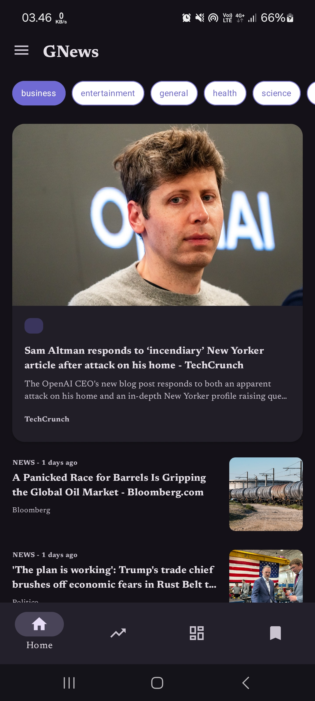
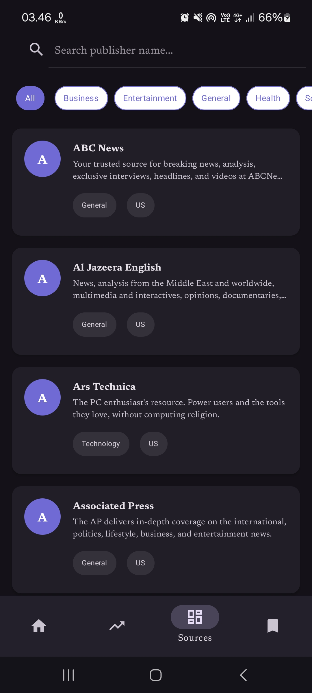
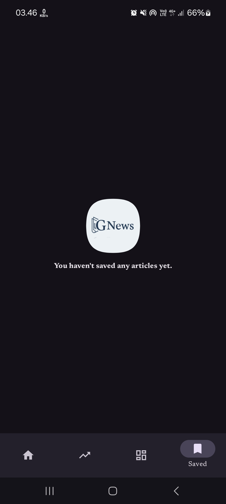
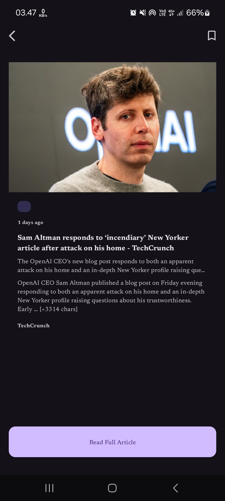
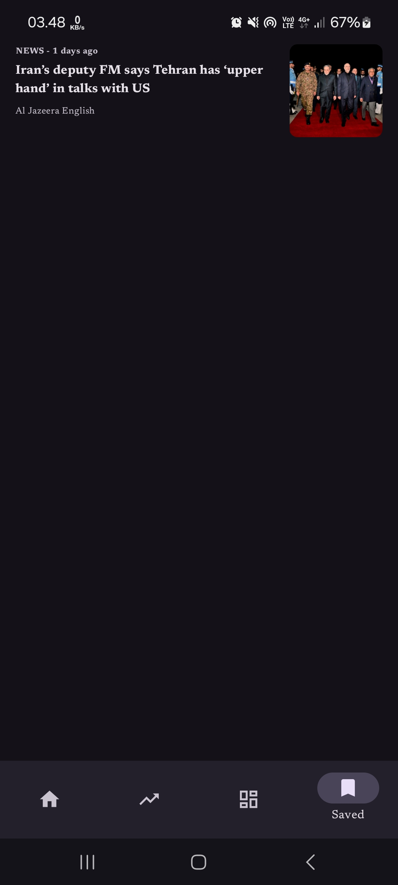
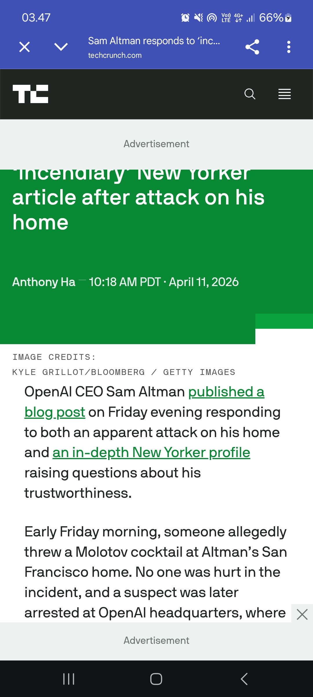

# 📰 GNews - Modern News App

[](https://kotlinlang.org)
[](https://developer.android.com/topic/architecture)
[](https://dagger.dev/hilt/)
[](https://developer.android.com/topic/libraries/architecture/room)
[](https://square.github.io/retrofit/)

<p align="center">
  
</p>

**GNews** is a high-performance news application built with **Clean Architecture** and **MVVM** pattern. It fetches real-time news data from [NewsAPI.org](https://newsapi.org/) and provides a seamless user experience with local caching, dependency injection, and modern UI components.

---

## ✨ Key Features

- **Real-time News**: Get the latest headlines and breaking news globally.
- **Search & Explore**: Easily search for articles or discover news from specific publishers.
- **Category Filtering**: Browse news by categories (Business, Technology, Sports, etc.) using interactive Material Chips.
- **Offline Persistence**: Save your favorite articles using Room Database for offline reading.
- **Swipe-to-Refresh**: Update your news feed instantly with a simple gesture.
- **Clean UI/UX**: Minimalist design following Material Design 3 guidelines.

---

## 📸 Screenshots

<p align="center">
  
  
  
  
</p>
<p align="center">
  
  
  
  
</p>
<p align="center">
  
  
  
</p>

---

## 🛠 Tech Stack

- **Kotlin**: Primary language for modern Android development.
- **Clean Architecture**: Ensures separation of concerns, scalability, and testability.
- **MVVM Pattern**: Facilitates clean UI logic and state management.
- **Dagger Hilt**: Standard library for Dependency Injection.
- **Retrofit & OkHttp**: Robust networking and API handling.
- **Room Database**: Local data persistence for caching "Saved" news.
- **Coroutines & Flow**: Reactive programming and asynchronous task handling.
- **Glide**: High-performance image loading and caching.
- **ViewBinding**: Type-safe access to UI components.

---

## 🏗 Project Structure

This project follows **Clean Architecture** principles, divided into three main layers:

```
app/src/main/java/com/hdev/gnews/
├── core/               # Shared utilities, Extensions, and Constants.
├── data/               # Data Layer: Implementation of Repositories.
│   ├── local/          # Room DB (DAO, Entity, Database class).
│   ├── remote/         # Retrofit API Service and DTO (Data Transfer Objects).
│   └── repository/     # Repository implementations (Logic for choosing Local vs Remote).
├── domain/             # Domain Layer: Pure Business Logic.
│   ├── model/          # Domain Models (POJO used by UI).
│   ├── repository/     # Repository Interfaces (Abstraction for Data Layer).
│   └── usecase/        # Specific business rules/actions.
└── presenter/          # Presentation Layer: UI Components (MVVM).
    ├── home/           # Home screen logic (Feed & Detail).
    ├── trends/         # Trending news and search functionality.
    ├── sources/        # News sources (publishers) catalog.
    └── saved/          # Offline saved articles management.
```

### Layer Responsibilities:
*   **Domain**: The most stable layer. It contains the business logic and rules. It is independent of any Android-specific libraries or frameworks.
*   **Data**: Orchestrates data from different sources (Remote API via Retrofit and Local Cache via Room).
*   **Presenter (UI)**: Manages UI states using ViewModels and displays data using Fragments/Activities. It communicates only with the Domain Layer via UseCases.

---

## 🚀 Getting Started

1.  **Clone the project**:
    ```sh
    git clone https://github.com/yourusername/GNews.git
    ```
2.  **Get an API Key**:
    Register at [NewsAPI.org](https://newsapi.org/) and copy your API key.
3.  **Setup API Key**:
    Add your API key to `local.properties`
    ```kotlin
    val API_KEY = "YOUR_KEY_HERE"
    ```
4.  **Build & Run**:
    Open in Android Studio and run on an Emulator or Physical Device.

---

**Developed by [Your Name]** - 2024
